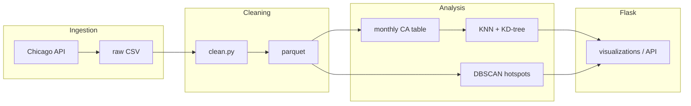

# Architecture — project-chaggg

Bu belge **Architecture & Design (rubric)** için yüksek seviye tasarımı özetler: bileşenler birbirinden nasıl ayrılır, veri nasıl akar, hangi yapı neden seçildi.

## Bileşenler

| Katman | Konum | Görev |
|--------|--------|--------|
| Ham veri → temiz CSV/parquet | `scripts/fetch.py`, `scripts/clean.py`, `scripts/utils.py`, `scripts/config.py` | İndirme, filtreleme, tip dönüşümü; `load_data` tek giriş noktası |
| Algoritmalar (from-scratch + yardımcılar) | `src/algorithms/` | KD-tree, KNN, metrikler, monthly aggregation, DBSCAN (modül bazında ayrık) |
| Batch / CLI | `scripts/run_*.py` | KNN prep & forecast, DBSCAN export, pipeline `main.py` |
| Web | `src/flask_app/` | Flask app factory, şablonlar, statik GeoJSON, KNN yolları (`knn_paths.py`) |

## Veri akışı (özet)

## Tasarım kararları (tradeoff)

1. **KD-tree + batch euclidean neighbor search**: Ay başına ~7k satır için KNN eğitimi hafif; tahmin döngüsü bilinçli olarak basit (oku-yorumla); büyük *n* için ağaç amortize \(O(\log n)\) sorgu hedeflenir, worst-case bölünme kötü olabilir — bu sınırlılık için **opt-in bruteforce** ile test/debug hizası kullanılır.

2. **Monthly community_area tablosu**: Olay düzeyi ~8M satır yerine agregasyon; KNN ve raporlama için ölçeklenebilir hedef değişken.

3. **`SpaceTimeScaler`**: UTM (metre) veya derece + `time_scale`; zaman-mesafe birimi tek kod yolunda toplanır (tekrarlı formül yok).

4. **Flask ve ağır veri**: Testlerde `CHAGGG_SKIP_DATA_LOAD=1`; KNN görünümü önceden üretilmiş `outputs/knn` artefaktlarına bağlı — prod-like kurulumda dosyalar yoksa uygulama yine açılır, talimat gösterilir.

## Test stratejisi

- **Doğruluk**: KD-tree kNN küçük rastgele sette bruteforce ile aynı komşu kümesi; mesafe ölçeği simetri/sıfır mesafe; train/test yılı çakışması yok.
- **Regresyon**: Flask route’ları (KNN çıktıları varsa API smoke).

Daha fazla ayrıntı: `docs/US-2.4_KNN_report.md`, `docs/US-2.6_DBSCAN_report.md` (ilgili kullanıcı hikâyeleri).
